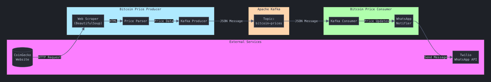

# Bitcoin Price Monitor

A real-time Bitcoin price monitoring system that tracks BTC/USD prices from CoinGecko and processes them using Apache Kafka. The system sends instant WhatsApp notifications for every price update, ensuring you stay informed about the latest Bitcoin market trends. 

**Note: This project is intended for educational purposes only and is not meant for actual trading or financial advice.**

## Architecture

## Demo
Check out the video demonstration [here](https://github.com/user-attachments/assets/c3113a2f-9ed3-4b44-a358-21250ac91d2f)

## Features

- **Real-time Bitcoin Price Scraping:** Fetches BTC/USD prices from CoinGecko at configurable intervals.
- **Kafka Producer-Consumer Architecture:** Utilizes Apache Kafka for reliable and scalable message streaming.
- **Instant WhatsApp Notifications:** Sends every Bitcoin price update instantly to your WhatsApp via Twilio.
- **Configurable Price Update Interval:** Set how frequently the system fetches Bitcoin prices.
- **Robust Error Handling:** Implements mechanisms to handle and recover from various errors gracefully.

## Architecture

The system consists of two main components:

1. **Producer** (`bitcoin_producer.py`):
   - Scrapes Bitcoin prices from CoinGecko at configurable intervals.
   - Publishes price updates to the Kafka topic `bitcoin-prices`.
   - Utilizes `confluent-kafka` for reliable message delivery.

2. **Consumer** (`bitcoin_consumer.py`):
   - Subscribes to the `bitcoin-prices` Kafka topic.
   - Processes incoming price updates.
   - Sends immediate WhatsApp notifications for each price update.

 
## Prerequisites

- **Python 3.8+**
- **Apache Kafka**: Ensure Kafka is installed and running on your machine.
- **Confluent Kafka Python Client**
- **Beautiful Soup 4**
- **Requests**
- **Twilio**: For WhatsApp notifications.
- **SMTP Server Access**: (If extending to email notifications in the future)
- **dotenv**
  
## Installation

1. **Clone the Repository:**
    ```bash
    git clone https://github.com/shosseini811/Bitcoin-value.git
    cd bitcoin-price-monitor
    ```

2. **Create a Virtual Environment:**
    ```bash
    python -m venv venv
    source venv/bin/activate  # On Windows: venv\Scripts\activate
    ```

3. **Install Dependencies:**
    ```bash
    pip install -r requirements.txt
    ```

4. **Configure Environment Variables:**
   
   Create a `.env` file in the project root with the following variables:
    ```env
    TWILIO_ACCOUNT_SID=your_twilio_account_sid
    TWILIO_AUTH_TOKEN=your_twilio_auth_token
    TWILIO_WHATSAPP_NUMBER=whatsapp:+14155238886  # Example Twilio Sandbox number
    TARGET_WHATSAPP_NUMBER=whatsapp:+1234567890   # Your WhatsApp number
    ```

   - **Twilio Account SID & Auth Token:** Obtain these from your Twilio dashboard.
   - **Twilio WhatsApp Number:** Use the Twilio Sandbox number or your dedicated WhatsApp number.
   - **Target WhatsApp Number:** The number where you want to receive price updates. Ensure it’s joined to the Twilio WhatsApp sandbox if using a trial account.

## Configuration

- **Price Update Interval:** 
  - Set in `bitcoin_producer.py` by modifying the `time.sleep()` duration.
  - Default is set to 10 seconds for testing purposes. Change to `300` seconds for a 5-minute interval:
    ```python
    time.sleep(300)  # 5 minutes interval
    ```

- **Twilio WhatsApp Configuration:**
  - Ensure that your Twilio WhatsApp numbers are correctly set in the `.env` file.
  
## Usage

1. **Start Kafka Broker:**
   Ensure that your Kafka broker is running. You can start Kafka using the following command:
    ```bash
    brew services start zookeeper
    brew services start kafka
    ```

2. **Run the Producer:**
    ```bash
    python bitcoin_producer.py
    ```
    - **Function:** Scrapes Bitcoin prices from CoinGecko and publishes them to the Kafka topic `bitcoin-prices`.

3. **Run the Consumer:**
    Open a new terminal, activate the virtual environment, and run:
    ```bash
    python bitcoin_consumer.py
    ```
    - **Function:** Subscribes to the `bitcoin-prices` Kafka topic and sends each price update to your WhatsApp.

## Testing

- **Verify WhatsApp Messages:**
  - Ensure that messages are being received instantly on your WhatsApp when the producer sends updates.

## Error Handling

- **Automatic Retry for Failed Web Scraping Attempts:**
  - The producer retries fetching the Bitcoin price if an error occurs during the HTTP request.

- **Kafka Delivery Confirmations:**
  - The producer logs delivery confirmations and errors for each message sent to Kafka.

- **Connection Error Handling:**
  - Both producer and consumer handle connection errors gracefully, logging them for debugging.

- **JSON Parsing Error Recovery:**
  - The consumer handles JSON decoding errors to prevent crashes due to malformed messages.

## Contributing

1. **Fork the Repository**
2. **Create Your Feature Branch:**
    ```bash
    git checkout -b feature/AmazingFeature
    ```
3. **Commit Your Changes:**
    ```bash
    git commit -m 'Add some AmazingFeature'
    ```
4. **Push to the Branch:**
    ```bash
    git push origin feature/AmazingFeature
    ```
5. **Open a Pull Request**


## Troubleshooting

- **No WhatsApp Messages Received:**
  - Ensure that your Twilio credentials are correctly set in the `.env` file.
  - Confirm that your WhatsApp number has joined the Twilio WhatsApp sandbox.
  - Check for any errors in the `bitcoin_consumer.py` logs.
  
- **Kafka Connection Issues:**
  - Verify that Kafka is running on `localhost:9092`.
  - Ensure that the `bitcoin-prices` topic exists. Create it if necessary:
    ```bash
    kafka-topics --create --topic bitcoin-prices --bootstrap-server localhost:9092 --partitions 1 --replication-factor 1
    ```
  
- **Twilio Errors:**
  - Review the error messages printed by the consumer when attempting to send WhatsApp messages.
  - Check your Twilio dashboard for any issues related to message delivery.

- **Web Scraping Failures:**
  - CoinGecko may have updated their website structure. Update the `extract_bitcoin_price` function accordingly.
  - Implement additional scraping logic or consider using CoinGecko’s API for more reliable data fetching.

## Future Enhancements

- **Email Notifications:** Extend the consumer to send email alerts in addition to WhatsApp messages.
- **Database Integration:** Store historical price data for analysis and reporting.
- **Dashboard:** Develop a web dashboard to visualize real-time Bitcoin prices and trends.
- **Multiple Cryptocurrency Support:** Extend monitoring to other cryptocurrencies beyond Bitcoin.

---

*Stay updated with the latest Bitcoin prices in real-time! 🚀*